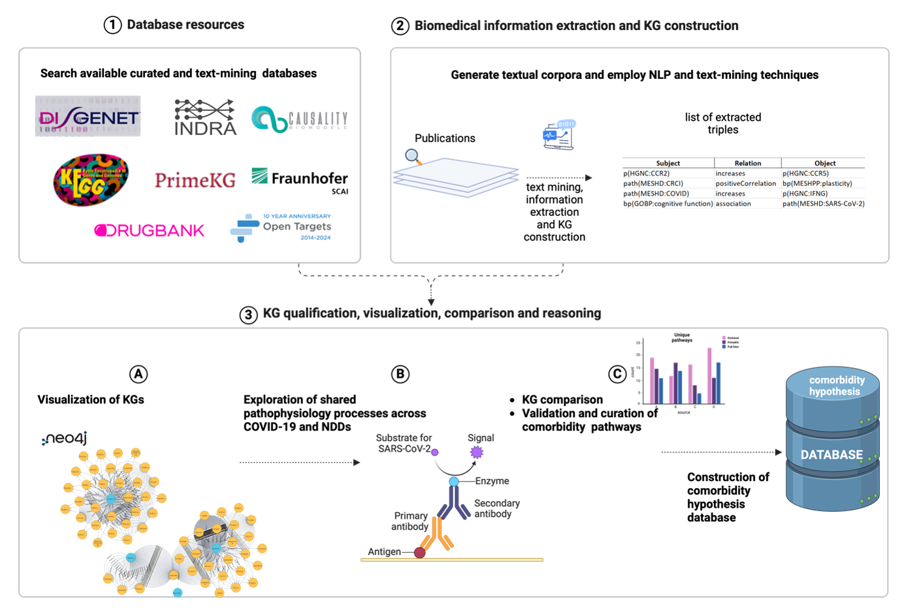

# Exploring the Current State of Knowledge on the Link Between COVID-19 and Neurodegeneration

This repository contains the data, scripts, and analyses used in the research titled **"Unravelling the Co-Morbidity between COVID-19 and Neurodegenerative Diseases Through Multi-scale Graph Analysis: A Systematic investigation of Biological Databases and Text Mining"**. The project leverages Neo4j paltform for graph-based analysis and integrates natural language processing to explore relationships between COVID-19 and neurodegenerative diseases (NDDs).


## Table of Contents
- [Overview](#overview)
- [Data](#data)
- [Sources](#sources)
- [Notebooks](#notebooks)
- [Getting Started](#getting-started)
- [Exploring the Covid-NDD Comorbidity Database](#Exploring-the-Covid-NDD-Comorbidity-Database)
- [Contact](#contact)

## Overview
This project explores the connections between COVID-19 and neurodegenerative diseases by:
1. **Integrating database information** about COVID-19 and NDDs and storing them in a graph structure.
2. **Extracting textual data** from scientific literature and using natural language processing pipelines for information extraction and KG construction. 
3. **Loading all KG** in Neo4j to identify and analyse relationships and pathways between entities such as genes, diseases, and chemicals.
4. **Construction of a hypothesis database for omorbidity between COVID-19 and NDDs** to explore, analyse, and visualise testable comorbidity hypotheses.

## Data
The repository includes the following directories:

1. **Expert-curated-publications**: Contains manually curated publications relevant to the study, ensuring high-quality and accurate information.

2. **PubTator3-results**: Includes results from PubTator3, a web-based system that offers a comprehensive set of features and tools for exploring biomedical literature using advanced text mining and AI techniques. :contentReference[oaicite:0]{index=0}

3. **Sherpa-results**: Houses outputs from Sherpa, a tool designed to assist in the curation of biomedical literature by providing automated annotations and insights.

4. **Textual-corpora-for-textmining**: Comprises textual corpora prepared for text mining purposes, facilitating the extraction of meaningful patterns and relationships regarding COVID-19 and NDD.

## Sources

### 1. `comorbidity-hypothesis-db.py`
- **Purpose**: Automatically opens the Neo4j Browser with prefilled credentials to connect to the AuraDB instance for comorbidity hypothesis exploration.
- **Key Features**:
  - Simplifies connection to Neo4j by generating a pre-configured URL.
  - Useful for direct interaction with the knowledge graph.
- **Usage**:
  Run the script, and the Neo4j Browser will open in your default web browser:
  ```bash
  python comorbidity-hypothesis-db.py
### 2. `comorbidity_database_neo4j_upload.py`

- **Purpose**: Uploads curated comorbidity hypothesis paths to the Neo4j AuraDB instance.
- **Key Features**:
  - Simplifies uploading comorbidity hypothesis candidates.
  - Standardizes and normalizes graph entities for compatibility.
- **Usage**:
  Run the script to upload the data:
  ```bash
  python comorbidity_database_neo4j_upload.py
  ```

## Getting Started

### Prerequisites

- **Neo4j AuraDB**: Ensure you have access to a Neo4j AuraDB instance. Use the provided connection details or set up your own.

- **Python Environment**: Install the required libraries:

  ```bash
  pip install neo4j pandas
 
## Notebooks

### 1. `analyze-neo4j.ipynb`
- **Purpose**: Analyzes the knowledge graph loaded to Neo4j to extract insights.
- **Key Features**:
  - Counts nodes and edges in the graph.
  - Executes community detection algorithms like Louvain using Neo4j's Graph Data Science (GDS) library.
  - Retrieves and visualizes properties of detected clusters
- **Usage**:
  Open the Jupyter Notebook and follow the instructions to:
  - Query the Neo4j database.
  - Get general statistics about nodes, triple and pathways, and analyze them.
 
### 2. `import-neo4j-all-dbs.ipynb`
- **Purpose**: These scripts are designed to upload multiple databases into Neo4j, providing a streamlined workflow for graph-based data integration and analysis.
- **Prerequisites**: 
  - bel_json_import package for BEL data conversion to eBEL format
  - Properly formatted database extracts
- **Key Features**:
  - Efficiently import graph data into Neo4j using a common schema
  - Seamless integration of complex biological networks
  - Privacy-aware data handling
- **Usage**:
  - Open the notebook in Jupyter Notebook or JupyterLab
  - Place data in required locations
  - Run cells specific to each source


## Exploring the Covid-NDD Comorbidity Database 

To manually explore the comorbidity graph database:

1. **Open the Neo4j Browser**:

   Navigate to [https://browser.neo4j.io](https://browser.neo4j.io).

2. **Enter the Connection Details**:

   - **URI**: `neo4j+s://09f8d4e9.databases.neo4j.io`

   - **Username**: `neo4j`

   - **Password**: Refer to the credentials provided in the [**src/comorbidity-hypothesis-db.py**](https://github.com/SCAI-BIO/covid-NDD-comorbidity-NLP/blob/main/src/comorbidity-hypothesis-db.py).

3. **Run Cypher Queries**:

   Once connected, you can execute Cypher queries to explore the graph. For example, to retrieve a sample of nodes:

   ```cypher
   MATCH (n) RETURN n LIMIT 10;
## Contact

For any questions, suggestions, or collaborations, please contact:

**Negin Babaiha**  
Email: [negin.babaiha@scai.fraunhofer.de](mailto:negin.babaiha@scai.fraunhofer.de)  
[Google Scholar Profile](https://scholar.google.com/citations?user=OwT3AMQAAAAJ)

Feel free to reach out for discussions regarding the project!
